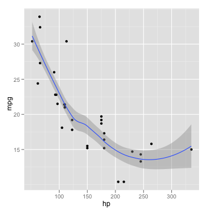

Now we write some code chunks in this markdown file:

    x <- 1:100
    y <- rnorm(100)
    model <- lm(y ~ x)
    summary(model)

    ## 
    ## Call:
    ## lm(formula = y ~ x)
    ## 
    ## Residuals:
    ##    Min     1Q Median     3Q    Max 
    ## -1.908 -0.661 -0.063  0.610  3.257 
    ## 
    ## Coefficients:
    ##             Estimate Std. Error t value Pr(>|t|)
    ## (Intercept) -0.27869    0.20071   -1.39     0.17
    ## x            0.00445    0.00345    1.29     0.20
    ## 
    ## Residual standard error: 0.996 on 98 degrees of freedom
    ## Multiple R-squared: 0.0167,	Adjusted R-squared: 0.00668 
    ## F-statistic: 1.67 on 1 and 98 DF,  p-value: 0.2 
    ## 

We can also produce plots:

    library(ggplot2)
    qplot(hp, mpg, data = mtcars) + geom_smooth()

 

So no more hesitation on using GitHub and **knitr**! You just write a minimal amount of code to get beautiful output on the web.
